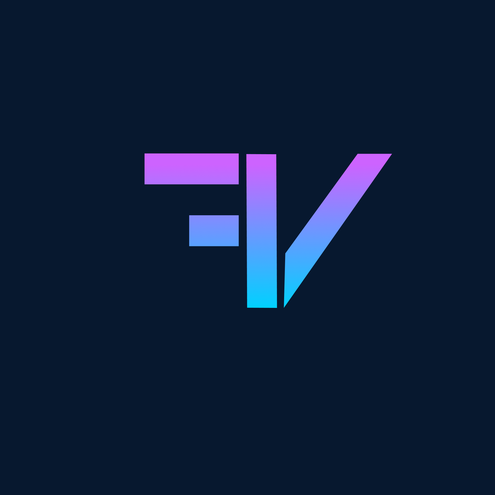
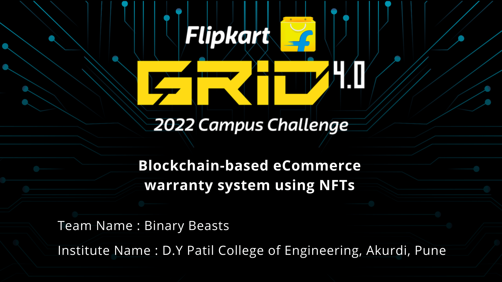
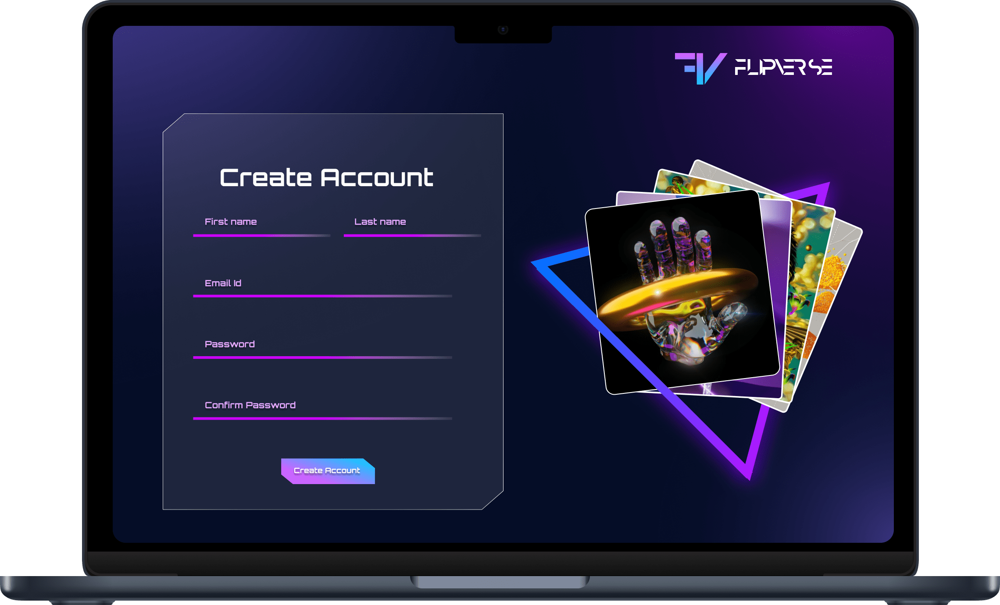
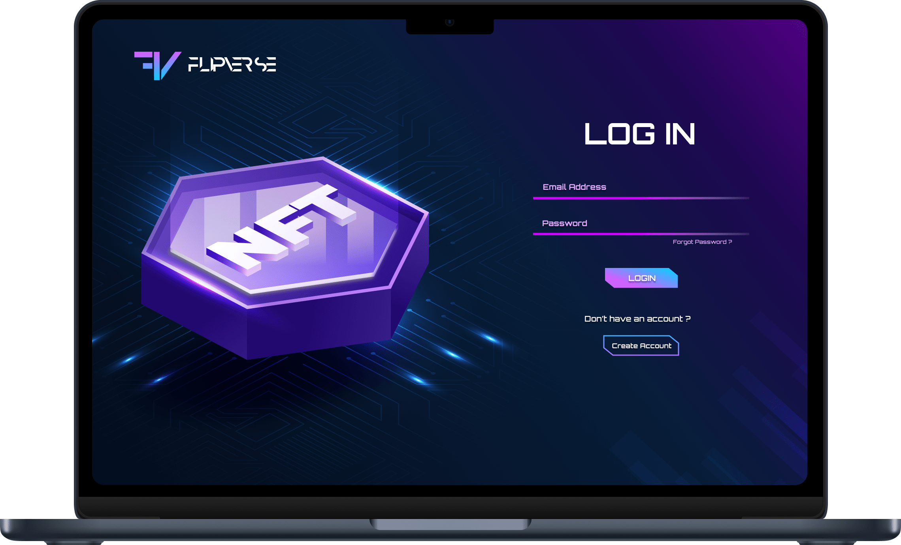
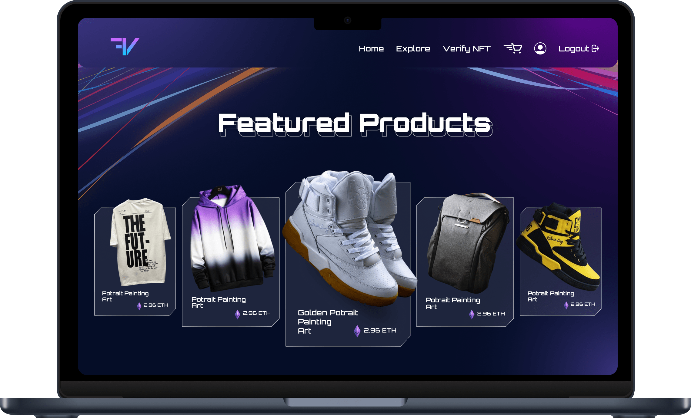
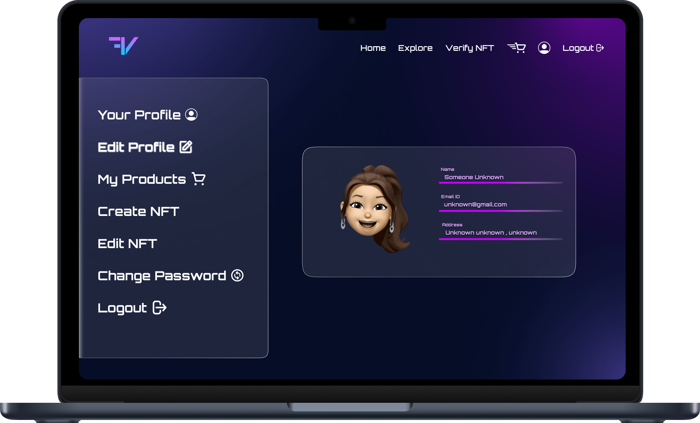
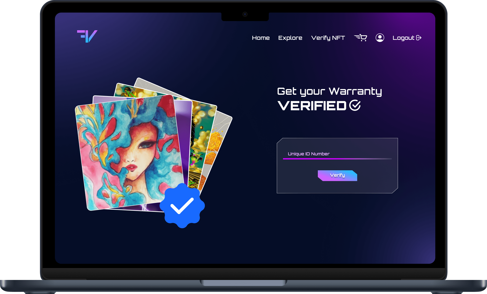
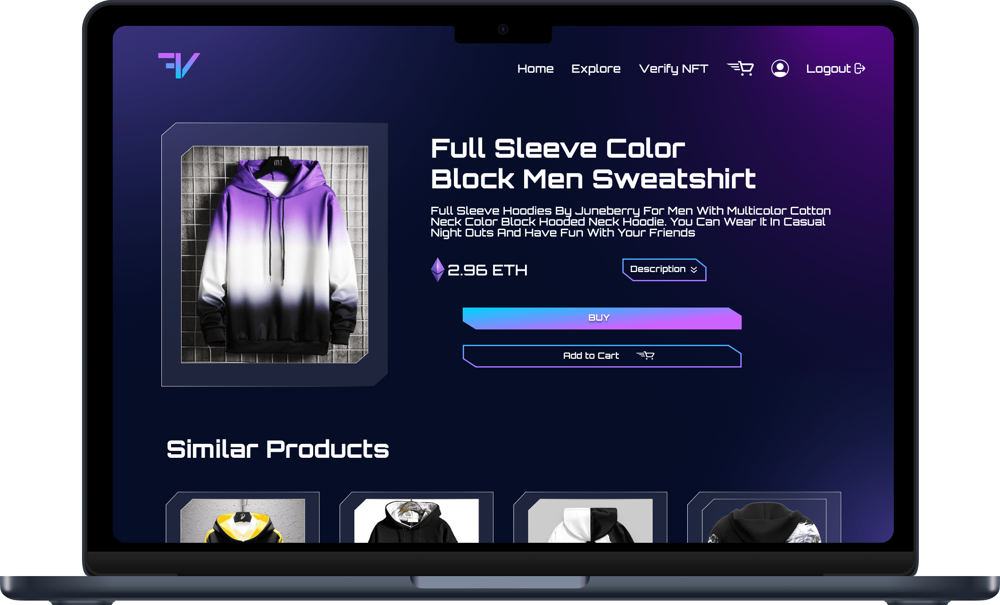
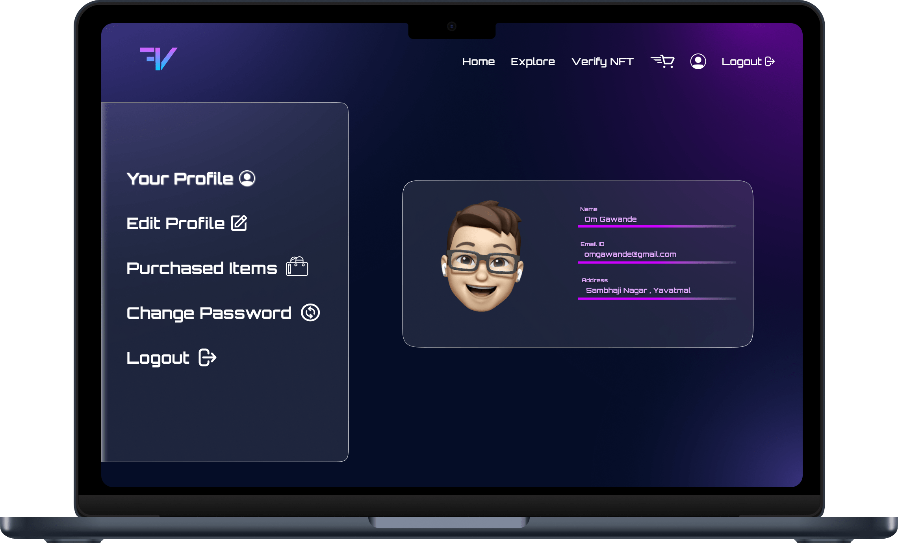

--- 

<div align = "center">


<h1 align="center"> <font size="5"> <b> flipshop </b></h1>
<!-- PROJECT LOGO -->

<h2><b>🔗 Blockchain-based eCommerce warranty system using NFTs</b></h2>

  </div>
  
---

<div align="center">

  </div>

---

<div align="center" style="display:flex ">

</div>
<table>
  <tr>
    <td></td>
    <td></td>
  </tr>
  <tr>
    <td></td>
    <td></td>
  </tr>
  <tr>
    <td></td>
    <td></td>
  </tr>
  <tr>
    <td></td>
    <td></td>
  </tr>
</table>

---

## About the Site 🚀

---

Blockchain-based eCommerce warranty system using NFTs
The objective is to replace the physical warranty and have block chain based warranty using NFT which will ensure
authenticity and security.

<br>

● Converting ownership authenticity and product warranty cards into decaying NFTs.📉<br>
● For instance, allow brands and retailers to introduce an NFT for each of their products, which allows
customers to receive the physical product along with a digital version of it.🚀<br>
● Customers can then use the digital NFT to verify the authenticity of their product, prove their ownership of their product, and transfer ownership of them upon resale.🎯<br>
● The brand/retailer should also be able to tie the digital NFT to its warranty program, allowing owners to trackrepairs and replacements to the original item.🤩<br>
● Decay the NFT once the warranty is over.🥸<br>
● WE used the Polygon blockchain to deploy our solution and demo the final product as a web prototype🔗<br>

---

## Tech Stack 💻

---

### WEB 3.0 :

- Hardhat 
  </div>
- Moralis 
  </div>
- Solidity 
  </div>
- Ethereum 
  </div>

### Frontend :

 

### Backend :

 


### How To Run :

1. Clone the repository

```bash
Make sure you are on Node version 20.x
```
2. Go to the project directory and install dependencies for both the client and server, and root directory as well.

```bash
npm install
```

```bash
cd ./client
npm install
```

```bash
cd ./server
npm install
```

3. Start the project

```bash
npm run dev
```